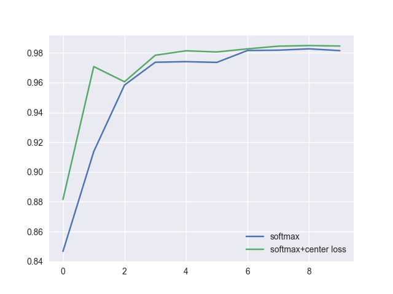
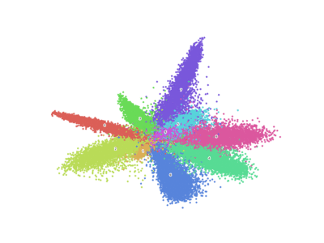
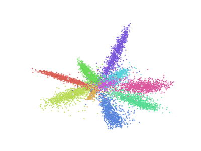
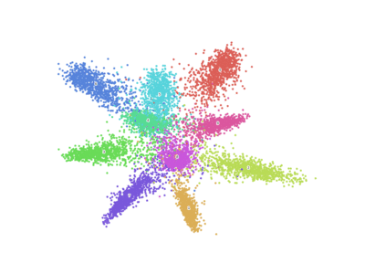

# MxNet implementation of the paper: A Discriminative Feature Learning Approach for Deep Face Recognition

## Requirements
```
pip install -r requirements.txt
```

## Training
1. Train with original softmax
```
$ python main.py --train --prefix=softmax
```

2. Train with softmax + center loss
```
$ python main.py --train --center_loss --prefix=center-loss
```

## Test
1. Test with original softmax
```
$ python main.py --test --prefix=softmax
```

2. Test with softmax + center loss
```
$ python main.py --test --prefix=center-loss
```

## Image
Comparison Accuracy curve:

</img>

### Softmax
Training:

</img>

Testing:

</img>

### Softmax + Center Loss
Training:

</img>

Testing:

</img>

